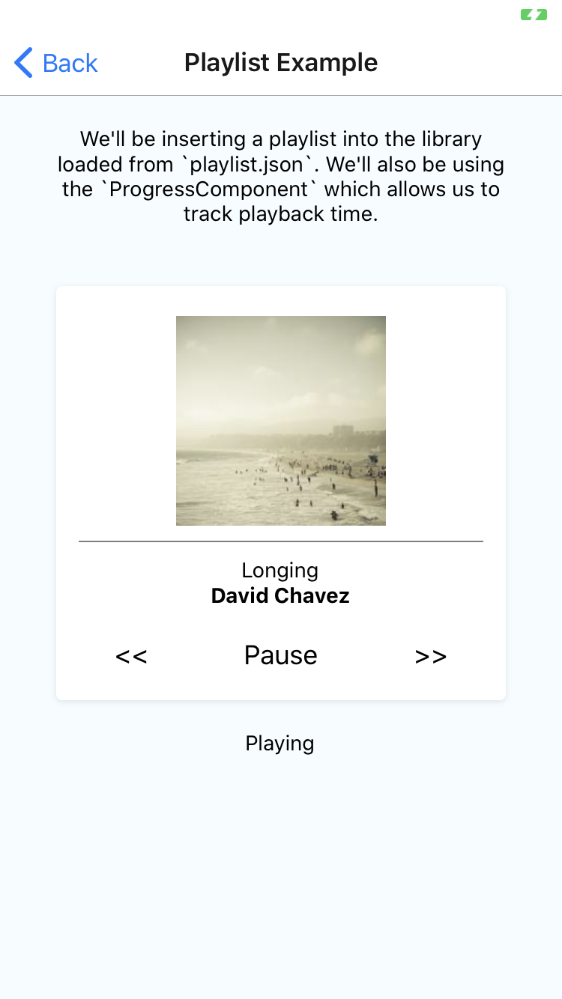
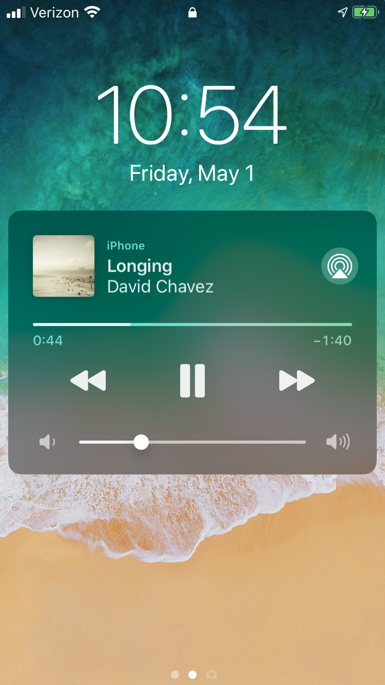
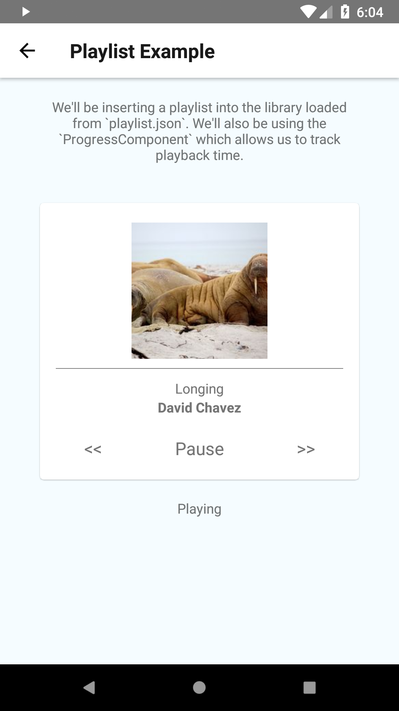
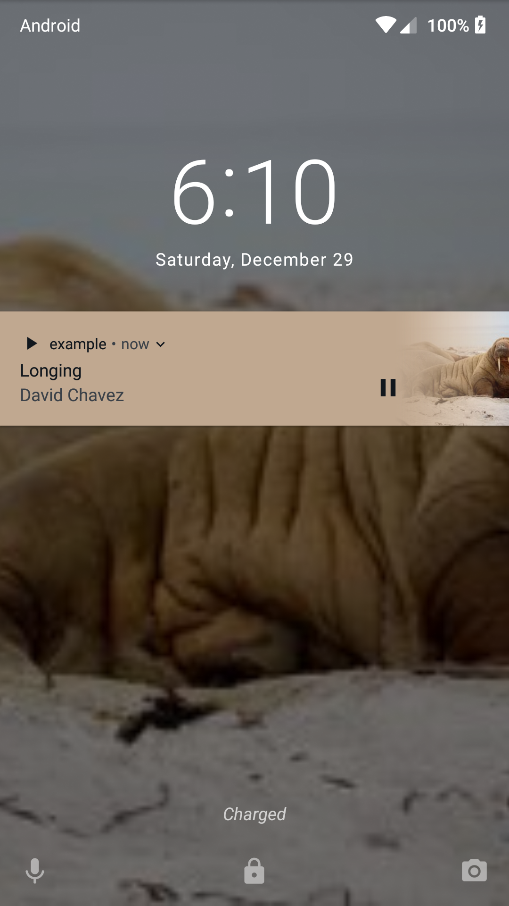
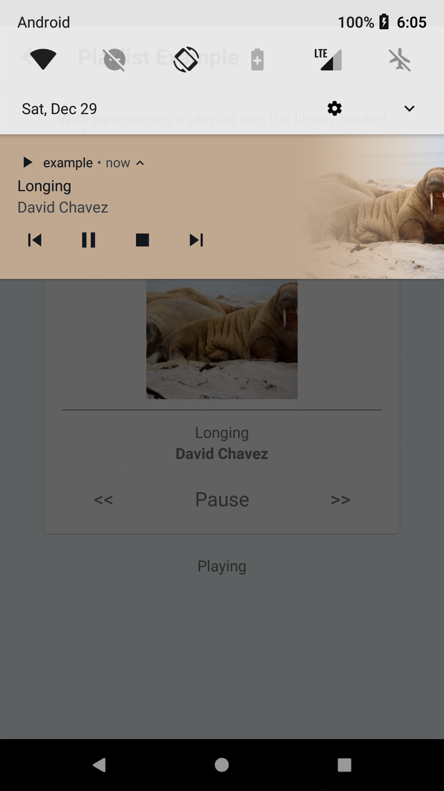

[](https://www.npmjs.com/package/react-native-track-player)
[](https://www.npmjs.com/package/react-native-track-player) 
[](https://discordapp.com/invite/ya2XDCR)
# react-native-track-player

A fully-fledged audio module created for music apps. Provides audio playback, external media controls, background mode and more!

---

* [Installation](https://react-native-kit.github.io/react-native-track-player/install/)
* [Getting Started](https://react-native-kit.github.io/react-native-track-player/api/)
* [Documentation](https://react-native-kit.github.io/react-native-track-player/documentation/)
* [Platform Support](https://react-native-kit.github.io/react-native-track-player/platform-support/)
* [Background Mode](https://react-native-kit.github.io/react-native-track-player/background/)
* [Build Preferences](https://react-native-kit.github.io/react-native-track-player/build-preferences/)

## Features

* **Lightweight** - Optimized to use the least amount of resources according to your needs
* **Feels native** - As everything is built together, it follows the same design principles as real music apps do
* **Multi-platform** - Supports Android, iOS and Windows
* **Media Controls support** - Provides events for controlling the app from a Bluetooth device, the lock screen, a notification, a smartwatch or even a car
* **Local or network, files or streams** - It doesn't matter where the media belongs, we've got you covered
* **Adaptive bitrate streaming support** - Support for DASH, HLS or SmoothStreaming
* **Caching support** - Cache media files to play them again without an internet connection
* **Background support** - Keep playing audio even after the app is in background
* **Fully Customizable** - Even the notification icons are customizable!
* **Supports React Hooks 🎣** - Includes React Hooks for common use-cases so you don't have to write them
* **Casting support** - Use in combination with [react-native-track-casting (WIP)](https://github.com/react-native-kit/react-native-track-casting) to seamlessly switch to any Google Cast compatible device that supports custom media receivers

## Platform Support

| Feature | Android | iOS | Windows |
| ------- | :-----: | :-: | :-----: |
| Load from the app bundle | ✓ | ✓ | ✓ |
| Load from the network | ✓ | ✓ | ✓ |
| Load from the file system | ✓ | ✓ | ✓ |
| Adaptive Bitrate Streaming | ✓ | ✓ | ✓ |
| Play/Pause/Stop/Reset | ✓ | ✓ | ✓ |
| Seeking/Volume | ✓ | ✓ | ✓ |
| Remote Media Controls | ✓ | ✓ | ✓ |
| Caching | ✓ | ✗ | ✗ |
| Events | ✓ | ✓ | ✓ |
| Background Mode | ✓ | ✓ | ✓ |
| [Casting (WIP)](https://github.com/react-native-kit/react-native-track-casting) | ✓ | ✗ | ✗ |

Check [Platform Support](https://react-native-kit.github.io/react-native-track-player/platform-support/) for more information.

## Why another music module?
After trying to team up modules like `react-native-sound`, `react-native-music-controls` and `react-native-google-cast`, I've noticed, that their structure and the way should be tied together can cause a lot of problems (mainly on Android). Those can heavily affect the app stability and user experience.

All audio modules (like `react-native-sound`) don't play in a separated service on Android, which should **only** be used for simple audio tracks in the foreground (such as sound effects, voice messages, etc.)

`react-native-music-controls` is meant for apps using those audio modules, but it has a few problems: the audio isn't tied directly to the controls. It can be pretty useful for casting (such as Chromecast).

`react-native-google-cast` works pretty well and also supports custom receivers, but it has fewer player controls, it's harder to integrate and still uses the Cast SDK v2.

## First Steps

If you want to get started with this module, check the [Getting Started](https://react-native-track-player.js.org/getting-started/) page.
If you want detailed information about the API, check the [Documentation](https://react-native-track-player.js.org/documentation/). You can also look at our example project [here](https://github.com/react-native-kit/react-native-track-player/tree/dev/example).

## Example

A basic example of how to play a track:

```javascript
import TrackPlayer from 'react-native-track-player';

const start = async () => {
    // Set up the player
    await TrackPlayer.setupPlayer();

    // Add a track to the queue
    await TrackPlayer.add({
        id: 'trackId',
        url: require('track.mp3'),
        title: 'Track Title',
        artist: 'Track Artist',
        artwork: require('track.png')
    });

    // Start playing it
    await TrackPlayer.play();
};
start();
```

If you want to get started with this module, check the [API](https://react-native-kit.github.io/react-native-track-player/api/) page.
If you want detailed information about the API, check the [Documentation](https://react-native-kit.github.io/react-native-track-player/documentation/).

## Example App
You can look at our example project [here](https://github.com/react-native-kit/react-native-track-player/tree/dev/example).

### iOS Screenshots
 

### Android Screenshots
  

## Maintainers
[Guilherme Chaguri](https://github.com/Guichaguri), [Dustin Bahr](https://github.com/curiousdustin) and [David Chavez](https://github.com/dcvz)

## Community
You can find us as part of the [React Native Folks](https://discordapp.com/invite/ya2XDCR) Discord in the `#react-native-track-player` channel.

## Support the development
Support the further development of this and other libraries.
- @dcvz: [Patreon](https://patreon.com/dcvz) | [Paypal](https://www.paypal.me/dcvz) | [Twitter](https://twitter.com/dchavezlive)
- @guichaguri: [Twitter](https://twitter.com/Guichaguri)
